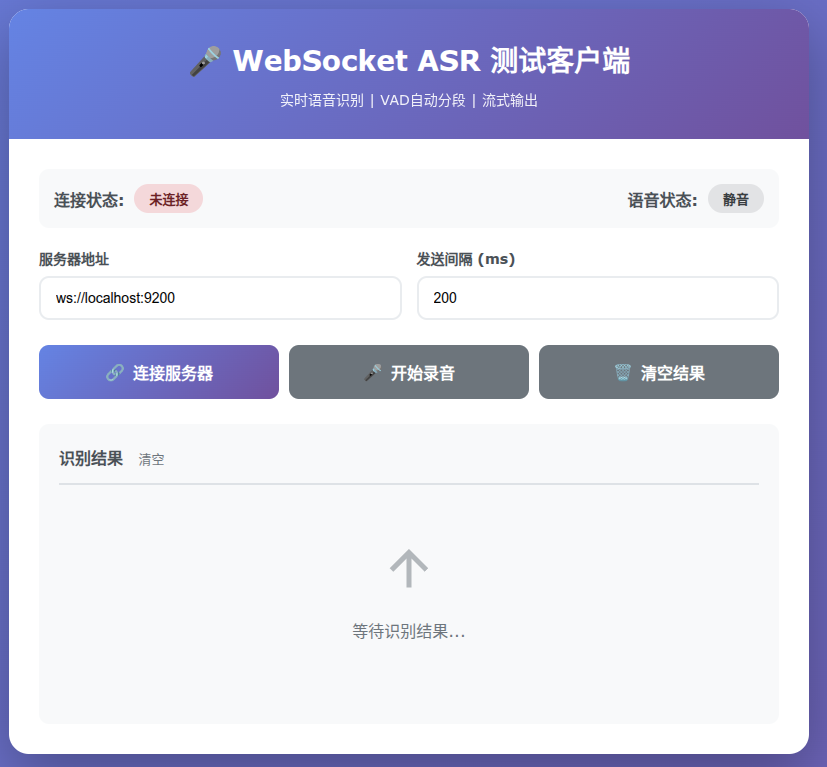
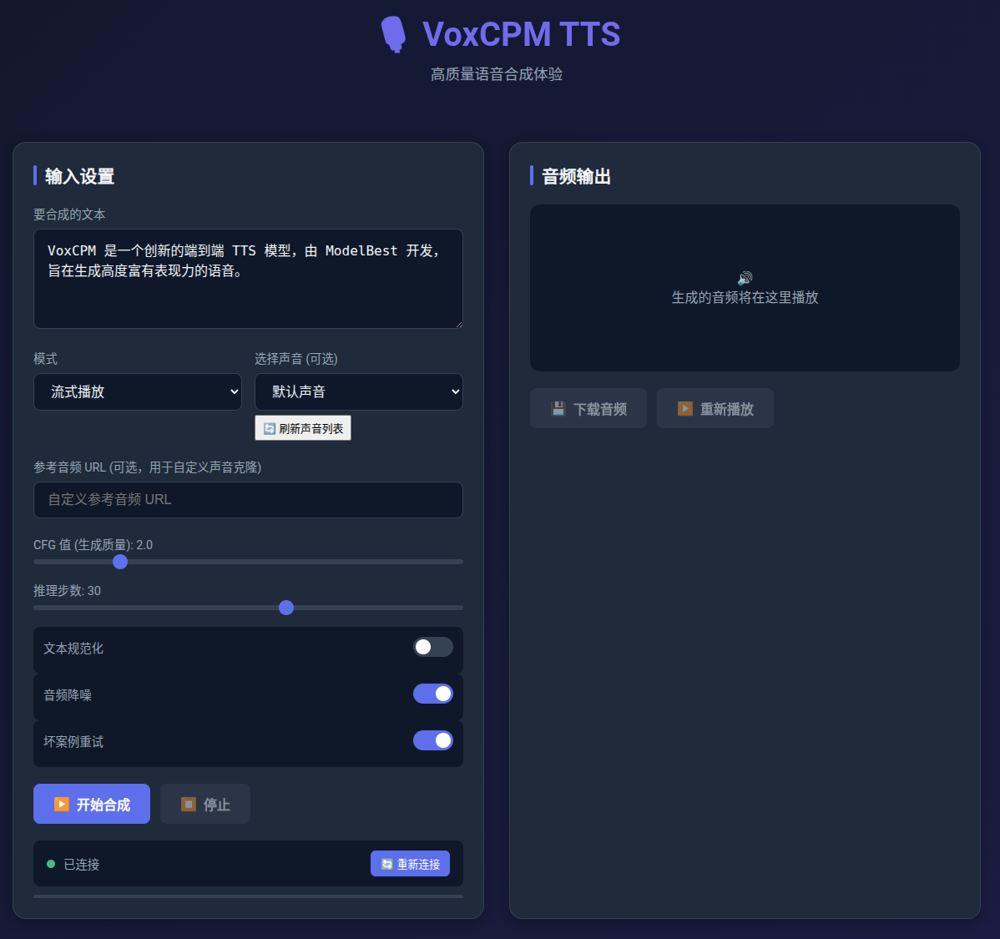
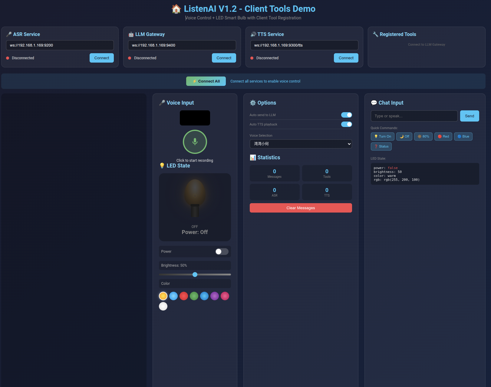

# ListenAI Server

适合arcs_mini开发板的 多模块 AI 语音服务系统 - 支持 ASR(语音识别)、TTS(语音合成)、VAD(语音活动检测) 等功能

## 社群
欢迎进群交流


## 模块说明

| 模块 | 功能 | 主要技术 | 端口 |
|------|------|----------|------|
| `asr/` | 实时语音识别服务，支持流式音频输入 | FunASR-Nano, WebSocket, TenVAD | WS: 9200, HTTP: 9201 |
| `tts/` | 文本转语音，支持声音克隆和流式输出 | VoxCPM-0.5B, WebSocket, 模型推理池 | WS: 9300, WebUI: 9301 |
| `vad/` | 语音活动检测，识别语音段起止 | TEN Framework, ONNX | - |
| `llm/` | 本地大语言模型服务，支持对话、工具调用、流式输出 | vLLM, Qwen3-4B, OpenAI兼容API | HTTP: 9500 |
| `music/` | 音乐HTTP服务，AI智能搜索，图片生成 | OpenAI API, SiliconFlow, Z-Image-Turbo | HTTP: 9100 |
| `cloud/` | LLM网关，会话管理，MCP工具调用 | WebSocket, MCP协议, aiohttp | WS: 9400 |


## 环境初始化

### 环境要求

- Python 3.10.x
- Linux (推荐 Ubuntu 22.04+)
- NVIDIA GPU 16G显存以上(推荐4090) + CUDA 12.x

### 安装python依赖

```bash
# 1. 安装 uv (如果未安装)
curl -LsSf https://astral.sh/uv/install.sh | sh

# 2. 创建虚拟环境
uv venv --python 3.10
source .venv/bin/activate

# 3. 安装依赖
uv pip install -r requirements.txt

```

### 初始化环境
```bash
source .venv/bin/activate
```

### 模型下载

#### ASR
``` bash
modelscope download --model FunAudioLLM/Fun-ASR-Nano-2512 --local_dir asr/FunAudioLLM/Fun-ASR-Nano-2512
```

#### tts
``` bash
modelscope download --model xiaowangge/voxcpm-0.5b --local_dir tts/VoxCPM-0.5B
```

#### llm
``` bash
modelscope download --model Qwen/Qwen3-4B-Instruct-2507 --local_dir llm/Qwen3-4B-Instruct-2507
```

#### music
根据歌词用于封面生成
``` bash
modelscope download --model Tongyi-MAI/Z-Image-Turbo --local_dir music/Z-Image-Turbo
```

#### vad
``` bash
mkdir -p vad
git clone https://github.com/TEN-framework/ten-vad.git vad/ten-vad
```


## 运行服务

### ASR
```bash
cd asr
sh auto.sh
```

#### 测试客户端
[http://localhost:9201/](http://localhost:9201/)


### TTS
```
cd tts
sh auto.sh
```

#### 测试客户端
[http://localhost:9301/](http://localhost:9301/)


### CLOUD
```bash
cd cloud
sh auto.sh
```

#### 测试客户端
[http://localhost:9401/](http://localhost:9401/)


### MUSIC
```bash
cd music
sh auto.sh
```

#### 测试客户端
[http://localhost:9100/](http://localhost:9100)


### LLM
```bash
cd llm
# llm的环境不一样，需要使用独立的虚拟环境
source .venv/bin/activate
./Qwen3-4B-Instruct-2507.sh
```

---

<div align="center">

## Star History

[](https://star-history.com/#justa-cai/listenai-server&Date)

</div>
